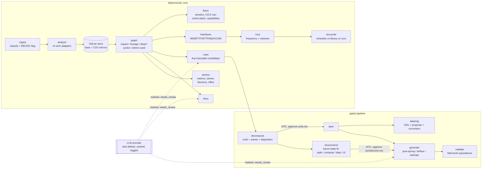

# legacymod

**Verdict up front:** legacymod is a local-first, auditable, vendor-neutral
mainframe-modernization platform in pure Python. It covers the analysis
half of what commercial platforms (AWS Transform, IBM watsonx Code
Assistant for Z + ADDI, Google Mainframe Assessment Tool + Dual Run,
Mechanical Orchard Imogen) do — inventory, knowledge graph, current-state
docs, business-rule mining with line-level traceability, assessment
(complexity/clones/blockers), decomposition into migratable units,
evidence-based future-state architecture recommendation (execution
style, compute, data store, integration, UI — per unit, with
confidence and a human gate), per-unit specs, target-code skeletons,
data-migration planning, and a
behavior-first equivalence harness — at $0, offline, with the LLM
strictly optional and never trusted as the final word. The biggest
caveat: it is an assessment-and-scaffolding platform, not a runtime — it
does not emulate JES/CICS/VSAM and deliberately does not auto-translate
whole programs (see Boundaries).

## The one architectural law

Deterministic parsing and the knowledge graph are the source of truth.
LLM output is always (a) traceable to source lines, (b) marked with
origin, confidence, and `needs_review`, and (c) gated by human approval
and/or the validation harness before anything downstream consumes it.
Whole-estate LLM code translation compounds logical errors and misses
undocumented behavior — the platform's spine is inventory → graph →
tests, with the LLM in bounded roles (explain, summarize, propose).

## Architecture



## Quickstart (about 10 minutes, all offline)

Requires Python 3.12+ on Windows, macOS, or Linux. From a fresh clone:

```powershell
pip install --user -e .
python -m legacymod.cli ingest samples/estate
python -m legacymod.cli analyze
python -m legacymod.cli graph
python -m legacymod.cli graph --impact PAYCALC
python -m legacymod.cli assess
python -m legacymod.cli rules --enrich
python -m legacymod.cli docs
python -m legacymod.cli decompose
```

`decompose` wrote a seed template. Give it a seed and (as the human
gate) approve the proposed units:

```powershell
Add-Content workspace/domains.seed.csv "payroll,PAYCALC"
python -m legacymod.cli decompose
(Get-Content workspace/units.csv) -replace ',proposed,', ',approved,' | Set-Content workspace/units.csv
```

(bash equivalents: `echo "payroll,PAYCALC" >> workspace/domains.seed.csv`
and `sed -i 's/,proposed,/,approved,/' workspace/units.csv`.)

Then spec, generate, plan the data migration, and validate:

```powershell
python -m legacymod.cli spec payroll
python -m legacymod.cli generate payroll --target java-spring
python -m legacymod.cli generate payroll --target openapi
python -m legacymod.cli datamig payroll
python workspace/datamig/payroll/convert_emp_record.py --self-test
python -m legacymod.cli validate payroll
Copy-Item samples/ops/capabilities.csv workspace/
python -m legacymod.cli interfaces
python -m legacymod.cli runs samples/ops/job_runs.csv
python -m legacymod.cli reconcile
python -m legacymod.cli flows
python -m legacymod.cli report
```

Expected: `validate payroll` reports **FAIL (1/2)** — the shipped demo
fixtures include a deliberately wrong "modernized output" so you can see
the comparator name the exact mismatching field (`PAY-GROSS`). Everything
lands under `workspace/`; the sample estate is never written to.

> `pip install --user` puts a `legacymod` console script in your user
> Scripts directory (e.g. `%APPDATA%\Python\Python313\Scripts`); add it
> to PATH to type `legacymod` instead of `python -m legacymod.cli`.

## Pipeline stages

| stage | command | what it produces (all under `workspace/`) |
|---|---|---|
| ingest | `ingest <src-dir>` | `inventory.csv` + SQLite store; EBCDIC flagged, never converted |
| analyze | `analyze` | typed facts from 14 adapters; `facts.csv` |
| graph | `graph [--impact/--lineage/--dead/--cycles/--where-used]` | `graph.json`, `graph.mmd` |
| assess | `assess` | `assess.md`, `metrics/clones/blockers/missing_artifacts.csv` |
| slice | `slice <prog> --seed <field>` | backward-slice report |
| docs | `docs [--enrich]` | `docs/` — overview, program/job pages, CRUD matrix |
| rules | `rules [--enrich]` | `rules.csv` — line-traceable rule catalog |
| decompose | `decompose` | `units.csv` (HITL gate), `waves.csv`, dispositions |
| recommend | `recommend [unit] [--enrich]` | `architecture.csv` (HITL gate) + `architecture.md` — best-fit future-state per unit, with evidence and confidence |
| spec | `spec <unit>` | `specs/<unit>.md` |
| datamig | `datamig <unit>` | PG DDL, relational proposal, runnable converters |
| generate | `generate <unit> --target java-spring\|airflow-dag\|openapi` | skeletons with traceability README |
| validate | `validate <unit>` | field-level equivalence report + timings |
| interfaces | `interfaces` | `interfaces.csv` + transfers_to edges |
| runs | `runs <job_runs.csv>` | frequencies, durations, abends, volume joins |
| reconcile | `reconcile` | `reconcile.csv` — decommission evidence, never deletions |
| flows | `flows` | batch-stream + CICS Mermaid, shares_resource, capability pages |
| review | `review [--apply]` | HITL queue CSV in/out |
| report | `report` | one-page status with honest numbers |

Technology adapters: COBOL (z/OS), copybooks, JCL + utility control
cards (IDCAMS/SORT/IEBGENER/NDM/FTP/BPXBATCH/XCOM), DB2 DDL, CICS BMS,
CICS CSD, MQSC, IMS DBD/PSB, REXX, Easytrieve, CA7, Control-M, HPNS
COBOL (Tandem), TAL (llm_assisted — no open-source TAL grammar exists as
of 2026-07-12).

## LLM usage (optional, off by default)

The default provider is a deterministic offline **stub** — the entire
pipeline and test suite run with zero network and zero API keys. Enable
a real provider in `legacymod.toml` (`provider = "claude_cli"`, which
shells out to a locally installed `claude` CLI). Every call is cached by
prompt hash and logged to `llm_log.csv`; enrichment only runs behind
explicit `--enrich` / `--llm-impl` flags; every AI-origin artifact is
visibly marked with provider, model, date, and `needs_review`.

**Data terms note:** customer source code processed with a cloud LLM
provider is subject to that provider's data terms. The stub/offline mode
exists for restricted code.

## Adding an adapter (worked example: PL/I stub)

One module, one protocol. Create `src/legacymod/adapters/pli.py`:

```python
from .base import Adapter, ArtifactRef, Fact, ParseContext, ParseResult
import re

class PliAdapter:
    name = "pli"
    tier = "deterministic"          # or "llm_assisted"

    def applicable(self, artifact: ArtifactRef) -> bool:
        return artifact.artifact_type == "pli"

    def parse(self, artifact, text, ctx) -> ParseResult:
        res = ParseResult()
        for no, line in enumerate(text.splitlines(), 1):
            m = re.match(r"\s*(\w+)\s*:\s*PROC(EDURE)?", line, re.I)
            if m:
                res.facts.append(Fact("program", m.group(1).upper(), {}, no, no))
        return res

ADAPTER: Adapter = PliAdapter()
```

Then (1) add `"pli"` to `_ADAPTER_MODULES` in `adapters/__init__.py`,
(2) teach `inventory._EXT_MAP`/`_sniff` to classify `.pli` files, and
(3) document the fact shapes in the module docstring. Facts flow into
the graph, docs, and rules automatically.

## Validated against a real estate (AWS CardDemo)

The platform is exercised against
[AWS CardDemo](https://github.com/aws-samples/aws-mainframe-modernization-carddemo)
(Apache-2.0), a full COBOL/CICS/VSAM/JCL credit-card application built
as a modernization-tooling test target — code this repo's authors never
saw while writing the parsers. The complete workspace output (graph,
docs, rules, scaffolds, equivalence fixture) is browsable at
[legacymod-carddemo](https://github.com/rajapadi/legacymod-carddemo).

**Analysis half** (as of 2026-07-19): 240 artifacts classified, 34,687
facts from 14 adapters, a 1,000-node knowledge graph — no crashes.
Accuracy spot-check: the impact query for the `CSUTLDTC` date utility
reported 4 call edges; a raw grep of the source confirms exactly 4
`CALL 'CSUTLDTC'` statements in the same 2 programs. Two classification
gaps this run exposed (`.prc` procs, standalone `.ctl` control cards)
were fixed in v0.1.1.

**Equivalence half** (as of 2026-07-20): the validation harness ran a
true Dual Run-style comparison on CBACT01C, the account-extract batch
job — legacy side compiled and executed by GnuCOBOL 3.2 via the
oracle, modern side a Python re-implementation, 50 accounts compared
field by field:

| case | result | legacy ms | modern ms | mismatched fields |
|---|---|---:|---:|---|
| case_cbact01c | PASS | 121.2 | 91.2 | - |

The first comparison run failed on exactly one field — and that is the
point. The legacy program NUL-pads its reformatted reissue date (the
tail of a work field the original z/OS assembler formatter never
writes), where any natural re-implementation space-pads; the comparator
named the field and bytes (`expected '20250520\x00\x00' actual
'20250520'`). Second find: CardDemo's ASCII data exports keep z/OS
sign overpunch (`{` = +0) in zoned fields — the COBOL runtime
normalizes it silently, naive modern code crashes on it. Recipe: load
the shipped ASCII export into a GnuCOBOL indexed file, stub the one
assembler CALL (`COBDATFT`) as a COBOL module in the case directory,
and declare dialect/copybooks/output-ddnames in `case.json`
(`oracle_std`, `oracle_includes`, `oracle_outputs`).

**Future-state fit** (as of 2026-07-20): on the same estate the
`recommend` stage tells the two unit families apart from evidence
alone — the batch extract unit gets "scheduled batch processing —
target a data pipeline, not a service" (Airflow DAGs, VSAM keys →
PostgreSQL), while the mixed CICS unit gets a split verdict: Spring
Boot + OpenAPI + Angular for the online half, orchestrated batch for
the rest, with DB2→PostgreSQL and IMS-flattening called out per data
store.

Honest numbers for the same exercise: 11/31 CardDemo programs compile
clean under `cobc -std=ibm` — the batch family. The 17 CICS online
programs stop at IBM's `DFHAID`/`DFHBMSCA` copybooks and 3 more have
copybook quirks; none of that is claimed as validated. One program's
extract path is proven equivalent, not the application.

## Boundaries (deliberate non-goals)

- No whole-program automatic COBOL→Java translation — skeletons + specs
  + marked LLM drafts only.
- No web UI, server, queue, or Neo4j (SQLite + CSV/Mermaid exports).
- No mainframe connectivity — input is a local source tree.
- No full TAL grammar (none exists open-source; regex + LLM tier only).
- No runtime emulation (Micro Focus/OpenFrame/LzLabs are a different
  product category — this platform assesses readiness for them).
- No terminal capture/replay or live traffic capture — the fixture
  harness is the local-first equivalent.
- Reconcile reports decommission candidates with `needs_review=1`; it
  never deletes and never excludes anything from analysis.

## Roadmap (deferred, in rough order of value)

PL/I · Assembler · Natural/ADABAS · VSAM binary-file readers · Zowe
ingestion path · SMF parsing · live scheduler APIs (CA7/Control-M) ·
screen-scraping capture agents / capture-and-replay integration points ·
Terraform/Kubernetes deployment templates · PDF report export.

## Development

```
pip install --user -e ".[dev]"
pytest --cov=legacymod
```

CI runs the suite on windows-latest + ubuntu-latest, Python 3.12/3.13.
Non-obvious implementation choices are logged in `docs/decisions.md`;
the architecture reference is `docs/architecture.md`.

## License

Apache-2.0.
